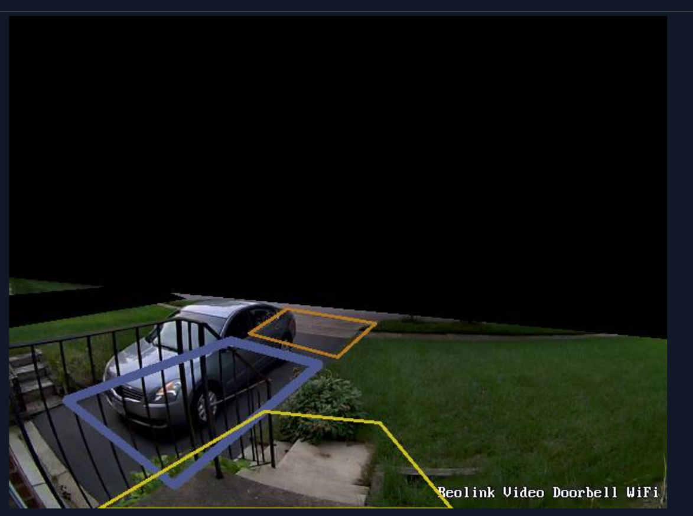
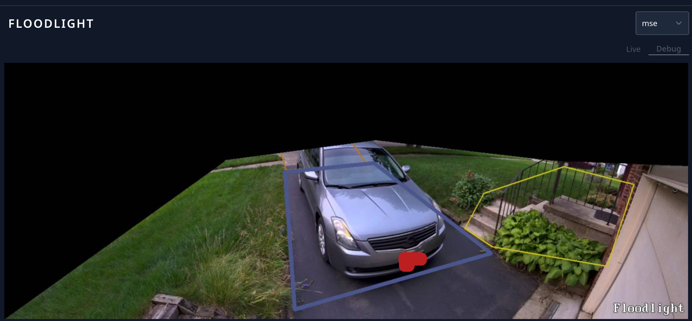

# Frigate Zones and Masks

Note: The `masks` are the black boxes.

## Doorbell



### Frigate Config

```
record:
    events:
    required_zones:
        - doorbell_front_door
        - doorbell_enter_driveway
motion:
    mask:
    - 640,314,640,0,0,0,0,254
    - 128,261,171,275,0,303,0,272
zones:
    doorbell_enter_driveway:
    coordinates: 319,332,356,299,270,285,233,309
    doorbell_driveway:
    coordinates: 160,457,301,339,215,316,55,374
    doorbell_front_door:
    coordinates: 360,396,248,385,87,480,430,480
```

## Floodlight



### Frigate Config

```
record:
    events:
    required_zones:
        - flood_enter_driveway
        - flood_front_door
motion:
    mask:
    - 0,0,491,0,494,221,0,576
    - 474,0,1536,0,1536,231,1230,219,834,173,494,218
zones:
    flood_enter_driveway:
    coordinates: 617,191,777,173,811,225,633,241
    flood_driveway:
    coordinates: 630,245,830,225,1093,428,652,554
    flood_front_door:
    coordinates: 1077,293,1257,233,1414,273,1354,457,1096,413,1034,372
```
